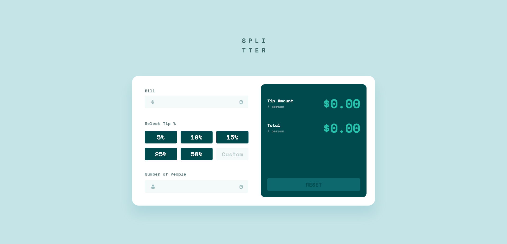
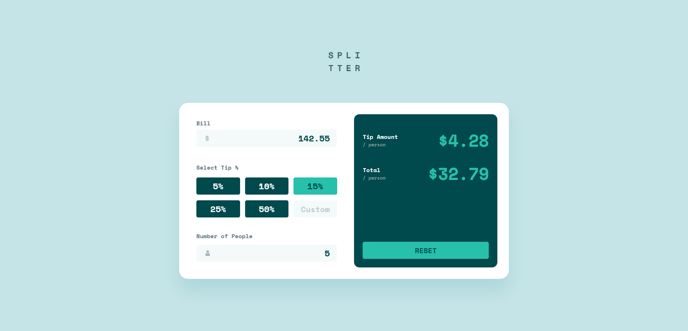
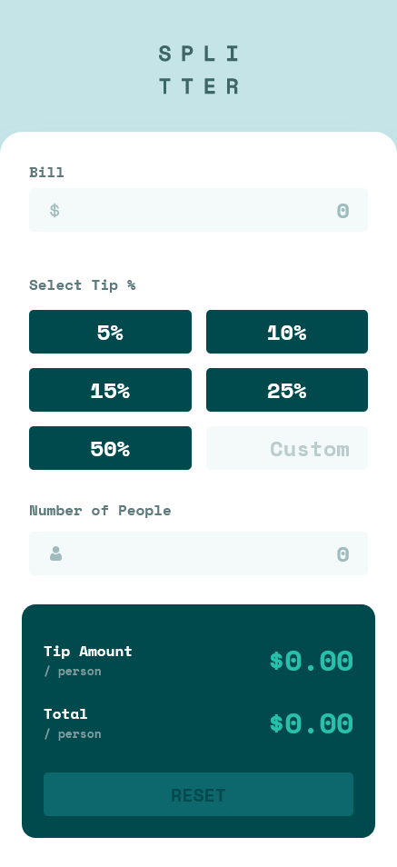
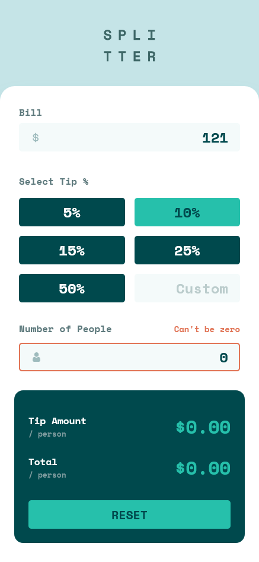

# Frontend Mentor - Tip Calculator App Solution

This is a solution to the [Tip calculator app challenge on Frontend Mentor](https://www.frontendmentor.io/challenges/tip-calculator-app-ugJNGbJUX).

## Table of contents

- [Overview](#overview)
  - [The challenge](#the-challenge)
  - [Screenshot](#screenshot)
  - [Links](#links)
- [My process](#my-process)
  - [Built with](#built-with)
  - [What I learned](#what-i-learned)
- [Author](#author)

## Overview

### The challenge

Users should be able to:

- View the optimal layout for the app depending on their device's screen size.
- See hover states for all interactive elements on the page.
- Calculate the correct tip and total cost of the bill per person.

### Screenshot






### Links

- Solution URL: [GitHub](https://github.com/wesleyjacoby/Tip-Calculator-App)
- Live Site URL: [GitHub Pages](https://your-live-site-url.com)

## My process

### Built with

- Semantic HTML5 markup
- CSS custom properties
- Flexbox
- CSS Grid
- Mobile-first workflow

### What I learned

The design had some challenges, like styling the radio buttons and getting everything to change color (background and text) on hover. The below code helped with that:

```css
input[type='radio']:checked+label {
    background-color: hsla(172, 67%, 45%, 1);
    color: var(--very-dark-cyan);
}
```

Otherwise, the rest was pretty easy. Most of my time went into catching user errors and preventing the app from breaking.

## Author

- Frontend Mentor - [@wesleyjacoby](https://www.frontendmentor.io/profile/wesleyjacoby)